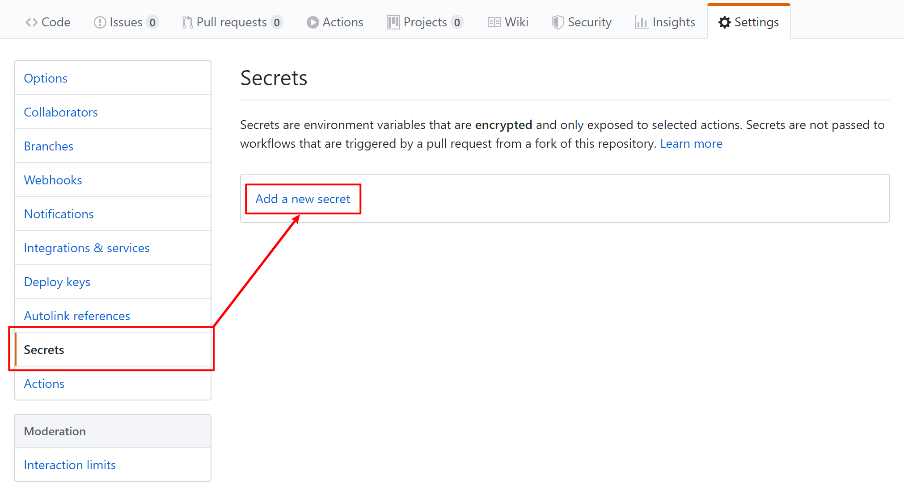
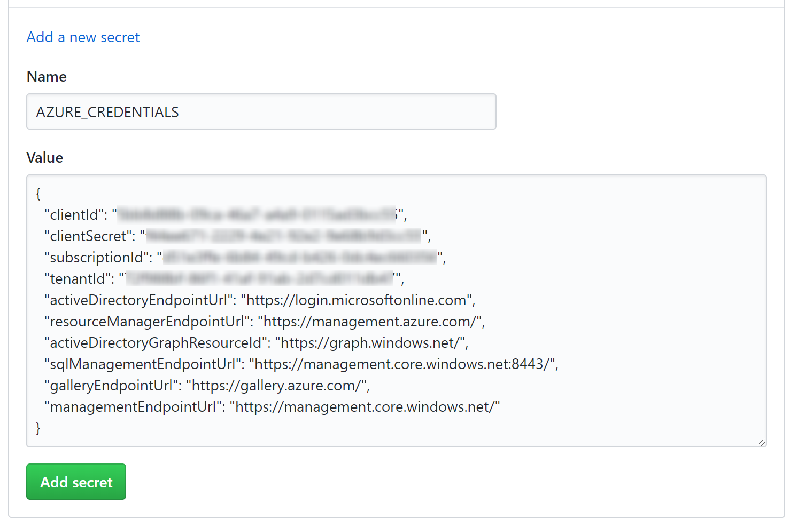
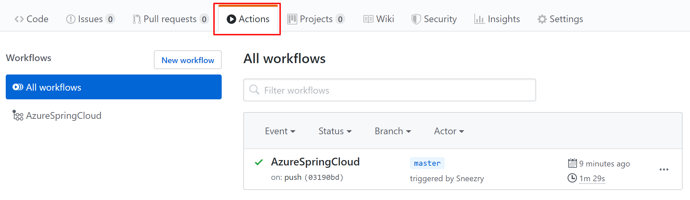
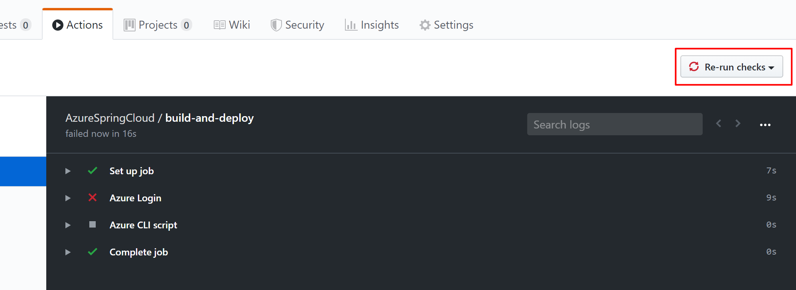

# GitHub Actions for Azure Spring Cloud

Azure has officially released [GitHub Actions for Azure](https://github.com/Azure/actions/), including `azure/login` handling Azure authentication. This tutorial shows how to use them to build up workflow with Azure Spring Cloud.
## Set up your GitHub repository and authenticate with Azure 

You need Azure credential to authorize Azure login action. To get Azure credential, you need execute command below on you local machine:

```
az ad sp create-for-rbac --role contributor --scopes /subscriptions/<SUBSCRIPTION_ID> --sdk-auth
```

> * If you haven't installed Azure CLI locally, see <https://docs.microsoft.com/en-us/cli/azure/install-azure-cli?view=azure-cli-latest>.
>
> * If you haven't logged with Azure CLI, run `az login` before execute command above.

If you would like to access to specific resource group, you can reduce the scope:

```
az ad sp create-for-rbac --role contributor --scopes /subscriptions/<SUBSCRIPTION_ID>/resourceGroups/{RESOURCE_GROUP} --sdk-auth
```

For more details about how to manage Azure Active Directory service principals, see <https://docs.microsoft.com/en-us/cli/azure/ad/sp?view=azure-cli-latest#az-ad-sp-create-for-rbac>

The command should output a JSON object similar to this:

```json
{
    "clientId": "<GUID>",
    "clientSecret": "<GUID>",
    "subscriptionId": "<GUID>",
    "tenantId": "<GUID>",
    ...
}
```

Fork [Piggy Metrics](https://github.com/Azure-Samples/piggymetrics), open GitHub repository page, and click **Settings** tab. Open **Secrets** menu, and click **Add a new secret**



Set the secret name to `AZURE_CREDENTIALS`, and its value to the JSON string which you get in [**Prerequisite**](#prerequisite) section.


## Provision your Azure Spirng Cloud service instance
- Using Azure CLI:
```bash
az extension add --name spring-cloud
az group create --location eastus --name <resource group name>
az spring-cloud create -n <service instance name> -g <resource group name>
az spring-cloud config-server git set -n <service instance name> --uri https://github.com/xxx/piggymetrics --label config
```

## Build up workflow

### Deploy with Azure CLI
Be aware that `az spring-cloud app create` is currently not idempotent and thus it is recommended to use this workflow on existing Azure Spring Cloud apps and instances.

- Azure CLI command for preparation:
```bash
az configure --defaults group=<service group name>
az configure --defaults spring-cloud=<service instance name>
az spring-cloud app create --name gateway
az spring-cloud app create --name auth-service
az spring-cloud app create --name account-service
```

- create `.github/workflow/main.yml` file in the repository:
```yml
name: AzureSpringCloud

env:
  GROUP: <resource group name>
  SERVICE_NAME: <service instance name>

jobs:
  build-and-deploy:
    runs-on: ubuntu-latest
    steps:
    
    - uses: actions/checkout@master
    
    - name: Set up JDK 1.8
      uses: actions/setup-java@v1
      with:
        java-version: 1.8
    
    - name: maven build, clean
      run: |
        mvn clean package -D skipTests
    
    - name: Azure Login
      uses: azure/login@v1
      with:
        creds: ${{ secrets.AZURE_CREDENTIALS }}
      
    - name: Install ASC AZ extension
      run: az extension add --name spring-cloud
   
    - name: Deploy with AZ CLI commands
      run: |
        az configure --defaults group=$GROUP
        az configure --defaults spring-cloud=$SERVICE_NAME
        az spring-cloud app deploy -n gateway --jar-path ${{ github.workspace }}/gateway/target/gateway.jar
        az spring-cloud app deploy -n account-service --jar-path ${{ github.workspace }}/account-service/target/account-service.jar
        az spring-cloud app deploy -n auth-service --jar-path ${{ github.workspace }}/auth-service/target/auth-service.jar
```

### Deploy with Maven Plugin
Another option is to use [Maven Plugin](https://docs.microsoft.com/en-us/azure/spring-cloud/spring-cloud-quickstart-launch-app-maven) for deploying Jar and updating App settings. `mvn azure-spring-cloud:deploy` is idempotent and will automatcally create Apps if needed. You don't need to create cooresponding apps in advance.

```yml
    # Maven plugin can cosume this authentication method automatically
    - name: Azure Login
      uses: azure/login@v1
      with:
        creds: ${{ secrets.AZURE_CREDENTIALS }}
    
    # Maven deploy, make sure you have correct configurations in your pom.xml
    - name: deploy to Azure Spring Cloud using Maven
      run: |
        mvn azure-spring-cloud:deploy
```

# Run the workflow

GitHub Actions should be enabled automatically after you push `.github/workflow/main.yml` to GitHub. It will be triggerd when you push a new commit. If you create this file in the browser, your action should have already run.

To verify your action has been enabled, click **Actions** tab on GitHub repository page:



If your action runs in error, such as you haven't set Azure credential, you can re-run checks after fix the error.

On GitHub repository page, click **Actions**, select the specific workflow task, then click **Re-run checks** button to re-run checks:


